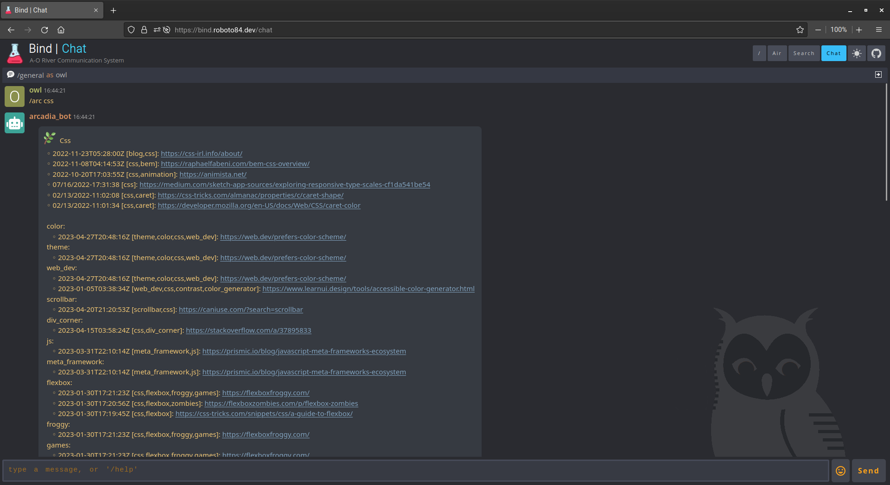
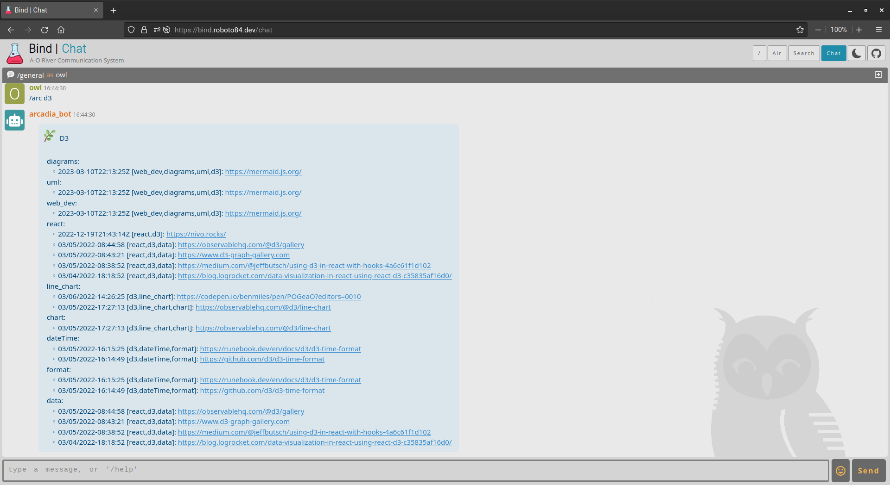

<h1 align="center">arcadia_bot</h1>

	

## About
`arcadia_bot` is a simple chatbot created to bridge the information flow between the `arcadia` project and the **wh00t** chat app.

## Usage
To see `arcadia_bot` used with **wh00t** on the `roboto_ui` go to the [roboto](https://github.com/roboto84/roboto) repo and follow its README.

	
     
    Dark mode
      
    
     
    Light mode

## Commit Conventions
Git commits follow [Conventional Commits](https://www.conventionalcommits.org) message style as explained in detail on their website.

 

    <a href="https://www.flaticon.com/free-icons/leaf" title="leaf icons">
        arcadia_bot icon created by Freepik - Flaticon
    </a>

